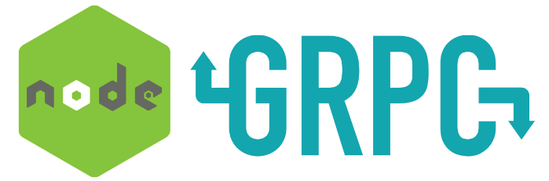

<h1 align="center">
  
</h1>

<h3 align="center">
  Exemplo de implementação gRPC NodeJs
</h3>

## Iniciando a aplicação do micro-service

Basta entrar na pasta **micro-service** e rodar os seguintes comandos:

- yarn install
- yarn start

O mesmo irá iniciar o serviço no **localhost** na porta **3334**.

## Iniciando a aplicação API

Com o micro-serviço já rodando em um terminal, basta entrar na pasta **api** e rodar os seguintes comandos em outro terminal:

- yarn install
- yarn start

A **API** estrá rodando no **localhost** na porta **3333**, então agora é só testar os seguintes requests:

### POST
  
  - http://localhost:3333/users
  
```
  {
    "email": "teste@teste.com",
    "password": "123456"
    "username": "Lucas"
  }
```

---

  - http://localhost:3333/sessions

```
  {
    "email": "teste@teste.com",
    "password": "123456"
  }
```

---

### GET
  
  - http://localhost:3333/users/1